# HotelManagementSystem 🏨💻

This repository contains the collaborative project called HotelManagementSystem, which is our first project. It is a comprehensive hotel management system designed to streamline operations and enhance the guest experience.

## Collaboration 👥

- [Md Ehsanul Haque](https://github.com/EhsanulHaqueSiam) - Student ID: 22-49370-3 🎓
- [Aonyendo Paul Neteish](https://github.com/NitPaul) - Student ID: 22-49421-3 🎓

Special thanks to our Java faculty, **Rashidul Hasan Nabil**, for guiding and inspiring us throughout this project.

## Project Description 📜

The HotelManagementSystem project utilizes various classes and interfaces to handle different functionalities within a hotel. The classes and their relationships are depicted in the Mermaid graph below:

```mermaid
classDiagram
direction BT
class BkashPayment {
  ~ JLabel bkash_lbl
  ~ JButton back_btn
  ~ JButton next_btn
  ~ JPasswordField pass_fld
  ~ JTextField num_fld
  + inputValidation(JTextField, JPasswordField) boolean
  + actionPerformed(ActionEvent) void
  + inputLength(JTextField, JPasswordField) boolean
  + confirmPayment(boolean, boolean, JFrame, JTextField, JPasswordField) void
}
class CheckIn {
  + String roomNo
  - JTextField gmail_fld
  - JButton clear_btn
  - JTextField cost_fld
  - JTextField date_fld
  - JTextField name_field
  - JTextField address_fld
  - JButton confirm_btn
  - JComboBox~String~ bed_Box
  - JFrame frame
  - JComboBox~String~ gender_Box
  - JTextField nationality_fld
  - JComboBox~String~ roomNo_Box
  - JTextField mbl_fld
  - JButton back_btn
  - JComboBox~String~ roomType_Box
  - JButton logOut_Btn
  + actionPerformed(ActionEvent) void
  + WriteCheckinData(String, String, String, String, String, String, String, File, String, String) void
}
class CheckOut {
  ~ String roomNo_B
  - JTextField CustomerNum_fld
  - JTextField pricePerDay_fld
  ~ String name
  ~ String CheckinDate
  - JButton logOut_btn
  - JButton back_btn
  ~ String roomPrice
  ~ String bed
  ~ String gender
  ~ String address
  - JTextField totalAmount_fld
  - JComboBox~String~ search_combo
  - JTable table
  ~ String gmail
  - JTextField checkInDate_fld
  - JTextField dayStay_fld
  ~ String nationality
  - JTextField CustomerName_fld
  - JTextField email_fld
  - JButton clear_btn
  - JButton checkOut_btn
  ~ String mobileNumber
  ~ String roomType
  ~ String roomNumToDelete
  + roomSearch() void
  + deleteRoomEntry() void
  + getCustomerData() void
  + actionPerformed(ActionEvent) void
}
class CheckOutRoomSearch {
<<Interface>>
  + deleteRoomEntry() void
}
class ClearCheckOut {
<<Interface>>
  + ClearCheckoutField(JTextField, JTextField, JTextField, JTextField, JTextField, JTextField, JTextField, JComboBox~String~, JTable) void
}
class ConfirmPayment {
<<Interface>>
  + inputLength(JTextField, JPasswordField) boolean
  + confirmPayment(boolean, boolean, JFrame, JTextField, JPasswordField) void
  + inputValidation(JTextField, JPasswordField) boolean
}
class CustomerDataEntry {
<<Interface>>
  + getCustomerData() void
}
class DashBoard {
  - JButton Manage_btn
  - JButton logoutButton
  - JButton checkoutButton
  - JButton checkinButton
  + actionPerformed(ActionEvent) void
}
class Edit {
  - JButton exitButton
  - JTextField userField
  - JButton backButton
  - JButton logoutButton
  - JButton usernameButton
  - JLabel user
  - JTextField fullField
  - JButton confirmButton1
  - JButton fullNameButton
  - JButton confirmButton3
  - JButton phoneButton
  - int check
  - JTextField phoneField
  - JLabel full
  - JLabel phone
  - JButton confirmButton2
  + isValidFullname(String) boolean
  + actionPerformed(ActionEvent) void
}
class ForgetPass {
  - JButton backButton
  - JButton next
  # int deleteLine
  - JTextField userField
  - JButton exitButton
  + actionPerformed(ActionEvent) void
}
class ForgetPass2 {
  - JTextField phoneField
  - JButton backButton
  - JButton next2
  - JButton exitButton
  + actionPerformed(ActionEvent) void
}
class ForgetPass3 {
  - JButton NextButton
  - JPasswordField newPass
  - JToggleButton EyeBtn2
  - ImageIcon off
  - JPasswordField confirmPass
  - JButton exitButton
  - JButton backButton
  - JToggleButton EyeBtn1
  - ImageIcon on
  + actionPerformed(ActionEvent) void
}
class Login {
  + String USERNAME
  # String fullName
  - JButton loginButton
  - ImageIcon on
  # boolean loginFlag
  # String oldPassword
  - JToggleButton EyeBtn
  # String phoneNumber
  - JButton exitButton
  - ImageIcon off
  - JButton signup
  - JPasswordField passwordField
  - JButton forgot
  # boolean isAdmin
  # String fullUsername
  - JTextField usernameField
  + getloginFlag() boolean
  + actionPerformed(ActionEvent) void
}
class Main {
  + main(String[]) void
}
class ManageRoom {
  - JTextField roomNum_fld
  - JComboBox~String~ bed_box
  - JButton logOut_btn
  - JButton del_btn
  - JButton add_btn
  - JTable table
  - JComboBox~String~ roomType_box
  - JButton back_btn
  - JTextField price_fld
  + actionPerformed(ActionEvent) void
}
class NagadPayment {
  ~ JButton next_btn
  ~ JTextField num_fld
  ~ JLabel bkash_lbl
  ~ JButton back_btn
  ~ JPasswordField pass_fld
  + actionPerformed(ActionEvent) void
}
class Payment {
  ~ JButton next_btn
  ~ JRadioButton bkash_btn
  ~ ButtonGroup bkashNagad_grp
  ~ JRadioButton nagad_btn
  ~ JLabel payment_lbl
  + actionPerformed(ActionEvent) void
}
class Profile {
  - JButton editButton
  - JButton backButton
  - JButton exitButton
  - JButton logoutButton
  + actionPerformed(ActionEvent) void
}
class ShowRoom {
  + roomDetails(JTextField, JComboBox~String~, JComboBox~String~, JComboBox~String~) void
}
class Signup {
  - JTextField usernameField
  - ImageIcon on
  - JPasswordField confirmPassField
  - JButton signup
  - JTextField fullField
  - ImageIcon off
  - JButton signin
  - JPasswordField passwordField
  - JButton exitButton
  - JToggleButton EyeBtn
  - JTextField phoneNumberField
  - JToggleButton EyeBtn2
  + actionPerformed(ActionEvent) void
  + isValidFullname(String) boolean
}
class UCheckIn {
  - String fullName
  - JTextField mbl_fld
  - JTextField nationality_fld
  - JTextField gmail_fld
  - JTextField address_fld
  - String MobileNumber
  - JComboBox~String~ roomType_Box
  - JComboBox~String~ roomNo_Box
  - JTextField name_field
  - JButton logOut_Btn
  - JButton clear_btn
  - JButton confirm_btn
  - JComboBox~String~ bed_Box
  + String roomNo
  - JTextField cost_fld
  - JButton back_btn
  - JFrame frame
  - JComboBox~String~ gender_Box
  - JTextField date_fld
  + WriteCheckinData(String, String, String, String, String, String, String, File, String, String) void
  + actionPerformed(ActionEvent) void
}
class UCheckOut {
  - JTextField customerName_fld
  - JTextField checkOut_fld
  - JButton logOut_btn
  - JButton back_btn
  ~ String MobileNumber
  - JTextField checkInDate_fld
  - JTextField pricePerDay_fld
  - JComboBox~String~ roomNum_combo
  ~ String bed
  ~ String roomPrice
  - JTextField totalAmount_fld
  ~ String gender
  - JTextField customerNum_fld
  - JButton clear_btn
  ~ String address
  - DefaultTableModel model
  ~ String gmail
  ~ String roomNo_B
  ~ String CheckInDate
  - JTextField dayStay_fld
  - JTextField email_fld
  ~ String nationality
  ~ String roomType
  ~ String name
  - JButton checkOut_btn
  - JTable table
  ~ String nameLogin
  + actionPerformed(ActionEvent) void
  + getCustomerData() void
  + deleteRoomEntry() void
}
class UDashBoard {
  - JButton checkOut_btn
  - JButton profile_btn
  - JButton logoutBtn
  - JButton checkIn_btn
  + actionPerformed(ActionEvent) void
}
class WriteCheckInInfo {
<<Interface>>
  + WriteCheckinData(String, String, String, String, String, String, String, File, String, String) void
}

BkashPayment  ..>  ConfirmPayment 
CheckIn  -->  ShowRoom 
CheckIn  ..>  WriteCheckInInfo 
CheckOut  ..>  CheckOutRoomSearch 
CheckOut  ..>  ClearCheckOut 
CheckOut  ..>  CustomerDataEntry 
NagadPayment  ..>  ConfirmPayment 
UCheckIn  -->  ShowRoom 
UCheckIn  ..>  WriteCheckInInfo 
UCheckOut  ..>  CheckOutRoomSearch 
UCheckOut  ..>  CustomerDataEntry 


```



The classes and interfaces in this project serve various purposes, including managing payments (💸 BkashPayment, 💸 NagadPayment, 💸 ConfirmPayment), handling check-in and check-out processes (🛎️ CheckIn, 🛎️ CheckOut, 🛎️ CheckOutRoomSearch, 🛎️ ClearCheckOut, 🛎️ CustomerDataEntry, 🛎️ WriteCheckInInfo), providing user interfaces (🖥️ DashBoard, ✏️ Edit, 🔑 ForgetPass, 🔑 ForgetPass2, 🔑 ForgetPass3, 🔑 Login, 🏠 Main, 🛏️ ManageRoom, 💰 Payment, 👤 Profile, 📄 ShowRoom, ✏️ Signup, 🛎️ UCheckIn, 🛎️ UCheckOut, 🖥️ UDashBoard), and more.

This project aims to demonstrate the practical implementation of object-oriented programming principles, guided by the expertise of our Java faculty, **Rashidul Hasan Nabil**. It provides a solid foundation for further development and enhancement.

Feel free to explore the source code and contribute to the project to make it even more robust and feature-rich. Happy coding! 🚀👩‍💻👨‍💻

Certainly! Here's the same content rewritten in Markdown format for your README file:

## Disclaimer

Please note that this project has the following limitations:

- No dedicated database: Instead of using a dedicated database like SQL or NoSQL, this project utilizes a simple text file as the database. All data will be stored and accessed from the text file.

- JavaFX not implemented: This project exclusively uses Java Swing for the user interface. JavaFX is not utilized in any part of the application.

## Installation

Follow these steps to install and run the Hotel Management System:

1. Clone the repository to your local machine:
   ```
   git clone https://github.com/EhsanulHaqueSiam/HotelManagementSystem.git
   ```

2. Navigate to the project directory:
   ```
   cd HotelManagementSystem
   ```

3. Compile the `Main.java` file using `javac`:
   ```
   javac Main.java
   ```

4. Run the application by executing the compiled `Main` class:
   ```
   java Main
   ```

5. The Hotel Management System should now be up and running. Follow the on-screen instructions to interact with the application.

# Contributors

Thanks to all the people who contribute. [[Contributors](https://github.com/EhsanulHaqueSiam/HotelManagementSystem/graphs/contributors)].

<a href="https://github.com/EhsanulHaqueSiam/HotelManagementSystem/graphs/contributors"></a>
## Usage

Once the application is running, you can perform various tasks such as managing hotel bookings, checking room availability, and more. Please refer to the application's user documentation for detailed instructions on how to use the system.

<details>
  <summary>Click to expand screenshots of the project</summary>
  
  <div align="center">
    <p>Login Page</p>
    
  </div>
  
  <div align="center">
    <p>SignUp Page</p>
    
  </div>

<div align="center">
    <p>Reset Password Page 1</p>
    
  </div>
  
  <div align="center">
    <p>Reset Password Page 2</p>
    
  </div>
  
  <div align="center">
    <p>Reset Password Page 3</p>
    
  </div>
  
  <div align="center">
    <p>User DasBoard Page</p>
    
  </div>
  
  <div align="center">
    <p>User Profile</p>
    
  </div>
  
  <div align="center">
    <p>User Information Edit Page</p>
    
  </div>
  
  <div align="center">
    <p>User ChechIn Page</p>
    
  </div>
  
  <div align="center">
    <p>User CheckOut Page</p>
    
  </div>
  
  <div align="center">
    <p>Payment Option Page</p>
    
  </div>
  
  <div align="center">
    <p>Bkash Payment Page</p>
    
  </div>
  
  <div align="center">
    <p>Nagad Payment Page</p>
    
  </div>
  
  <div align="center">
    <p>Admin DashBoard Page</p>
    
  </div>
  
  <div align="center">
    <p>Manage Room Page</p>
    
  </div>
  
  <div align="center">
    <p>Admin CheckIn page</p>
    
  </div>
  
  <div align="center">
    <p>Admin CheckOut Page</p>
    
  </div>
  
  </details>
