# HotelManagementSystem 🏨💻

This repository contains the collaborative project called HotelManagementSystem, which is our first project. It is a comprehensive hotel management system designed to streamline operations and enhance the guest experience.

## Contributors 👥

- [Md Ehsanul Haque](https://github.com/EhsanulHaqueSiam) - Student ID: 22-49370-3 🎓
- [Aonyendo Paul Neteish](https://github.com/NitPaul) - Student ID: 22-49421-3 🎓

Special thanks to our Java faculty, **Rashidul Hasan Nabil**, for guiding and inspiring us throughout this project.

## Project Description 📜

The HotelManagementSystem project utilizes various classes and interfaces to handle different functionalities within a hotel. The classes and their relationships are depicted in the Mermaid graph below:

```mermaid
classDiagram
direction BT
class BkashPayment {
  ~ JLabel bkash_lbl
  ~ JTextField num_fld
  ~ JButton next_btn
  ~ JPasswordField pass_fld
  ~ JButton back_btn
  + actionPerformed(ActionEvent) void
}
class CheckIn {
  - JFrame frame
  - JButton clear_btn
  - JButton logOut_Btn
  - JTextField nationality_fld
  - JTextField date_fld
  + String roomNo
  - JTextField mbl_fld
  - JTextField gmail_fld
  - JTextField address_fld
  - JButton confirm_btn
  - JComboBox~String~ roomNo_Box
  - JComboBox~String~ roomType_Box
  - JComboBox~String~ bed_Box
  - JComboBox~String~ gender_Box
  - JTextField name_field
  - JTextField cost_fld
  - JButton back_btn
  + actionPerformed(ActionEvent) void
  + WriteCheckinData(String, String, String, String, String, String, String, File, String, String) void
}
class CheckOut {
  ~ String gender
  - JTextField dayStay_fld
  - JTextField pricePerDay_fld
  - JComboBox~String~ search_combo
  - JTextField CustomerNum_fld
  - JTextField checkInDate_fld
  ~ String CheckinDate
  - JButton checkOut_btn
  - JButton logOut_btn
  ~ String bed
  - JButton back_btn
  ~ String roomNumToDelete
  ~ String roomPrice
  ~ String gmail
  ~ String nationality
  - JTextField email_fld
  ~ String roomType
  - JTextField totalAmount_fld
  ~ String mobileNumber
  ~ String name
  ~ String address
  - JButton clear_btn
  - JTable table
  - JTextField CustomerName_fld
  ~ String roomNo_B
  + getCustomerData() void
  + deleteRoomEntry() void
  + roomSearch() void
  + actionPerformed(ActionEvent) void
}
class CheckOutRoomSearch {
<<Interface>>
  + deleteRoomEntry() void
}
class ClearCheckOut {
<<Interface>>
  + ClearCheckoutField(JTextField, JTextField, JTextField, JTextField, JTextField, JTextField, JTextField, JComboBox~String~, JTable) void
}
class ConfirmPayment {
<<Interface>>
  + confirmPayment(boolean, boolean, JFrame) void
}
class CustomerDataEntry {
<<Interface>>
  + getCustomerData() void
}
class DashBoard {
  - JButton Manage_btn
  - JButton logoutButton
  - JButton checkoutButton
  - JButton checkinButton
  + actionPerformed(ActionEvent) void
}
class Edit {
  - int check
  - JButton confirmButton2
  - JButton phoneButton
  - JButton backButton
  - JButton usernameButton
  - JTextField fullField
  - JButton fullNameButton
  - JTextField userField
  - JTextField phoneField
  - JLabel full
  - JButton confirmButton3
  - JButton confirmButton1
  - JButton logoutButton
  - JLabel phone
  - JLabel user
  - JButton exitButton
  + actionPerformed(ActionEvent) void
}
class ForgetPass {
  - JButton next
  - JTextField userField
  - JButton exitButton
  # int deleteLine
  - JButton backButton
  + actionPerformed(ActionEvent) void
}
class ForgetPass2 {
  - JButton next2
  - JButton exitButton
  - JTextField phoneField
  - JButton backButton
  + actionPerformed(ActionEvent) void
}
class ForgetPass3 {
  - JPasswordField newPass
  - JToggleButton EyeBtn2
  - JPasswordField confirmPass
  - JButton backButton
  - ImageIcon off
  - ImageIcon on
  - JButton exitButton
  - JButton NextButton
  - JToggleButton EyeBtn1
  + actionPerformed(ActionEvent) void
}
class Login {
  # boolean isAdmin
  # String fullName
  # String fullUsername
  - JToggleButton EyeBtn
  - ImageIcon off
  # String phoneNumber
  - JTextField usernameField
  - ImageIcon on
  - JButton loginButton
  + String USERNAME
  # boolean loginFlag
  - JButton signup
  - JButton exitButton
  # String oldPassword
  - JButton forgot
  - JPasswordField passwordField
  + actionPerformed(ActionEvent) void
  + getloginFlag() boolean
}
class Main {
  + main(String[]) void
}
class ManageRoom {
  - JComboBox~String~ bed_box
  - JTextField price_fld
  - JButton del_btn
  - JTable table
  - JButton logOut_btn
  - JComboBox~String~ roomType_box
  - JButton back_btn
  - JButton add_btn
  - JTextField roomNum_fld
  + actionPerformed(ActionEvent) void
}
class NagadPayment {
  ~ JPasswordField pass_fld
  ~ JTextField num_fld
  ~ JButton next_btn
  ~ JButton back_btn
  ~ JLabel bkash_lbl
  + actionPerformed(ActionEvent) void
}
class Payment {
  ~ JRadioButton bkash_btn
  ~ JLabel payment_lbl
  ~ JButton next_btn
  ~ JRadioButton nagad_btn
  ~ ButtonGroup bkashNagad_grp
  + actionPerformed(ActionEvent) void
}
class Profile {
  - JButton editButton
  - JButton logoutButton
  - JButton backButton
  - JButton exitButton
  + actionPerformed(ActionEvent) void
}
class ShowRoom {
  + roomDetails(JTextField, JComboBox~String~, JComboBox~String~, JComboBox~String~) void
}
class Signup {
  - JTextField fullField
  - JButton signin
  - JPasswordField confirmPassField
  - ImageIcon on
  - ImageIcon off
  - JToggleButton EyeBtn2
  - JButton exitButton
  - JToggleButton EyeBtn
  - JTextField phoneNumberField
  - JPasswordField passwordField
  - JButton signup
  - JTextField usernameField
  + actionPerformed(ActionEvent) void
}
class UCheckIn {
  - JTextField nationality_fld
  - JTextField gmail_fld
  - JTextField address_fld
  - JComboBox~String~ gender_Box
  - String fullName
  - JTextField name_field
  - JTextField date_fld
  - JTextField mbl_fld
  - JButton clear_btn
  - JButton back_btn
  - JComboBox~String~ roomNo_Box
  - String MobileNumber
  - JComboBox~String~ roomType_Box
  - JButton confirm_btn
  - JFrame frame
  - JComboBox~String~ bed_Box
  + String roomNo
  - JButton logOut_Btn
  - JTextField cost_fld
  + WriteCheckinData(String, String, String, String, String, String, String, File, String, String) void
  + actionPerformed(ActionEvent) void
}
class UCheckOut {
  ~ String roomPrice
  - JButton back_btn
  ~ String roomType
  - JTable table
  - JTextField checkOut_fld
  ~ String nameLogin
  - JComboBox~String~ roomNum_combo
  - JButton clear_btn
  ~ String address
  ~ String CheckInDate
  ~ String gmail
  - JTextField totalAmount_fld
  ~ String name
  - JTextField customerName_fld
  - JButton logOut_btn
  - JTextField dayStay_fld
  - JTextField pricePerDay_fld
  - DefaultTableModel model
  ~ String roomNo_B
  - JTextField checkInDate_fld
  ~ String MobileNumber
  ~ String gender
  - JTextField email_fld
  ~ String bed
  ~ String nationality
  - JTextField customerNum_fld
  - JButton checkOut_btn
  + getCustomerData() void
  + actionPerformed(ActionEvent) void
  + deleteRoomEntry() void
}
class UDashBoard {
  - JButton profile_btn
  - JButton logoutBtn
  - JButton checkOut_btn
  - JButton checkIn_btn
  + actionPerformed(ActionEvent) void
}
class WriteCheckInInfo {
<<Interface>>
  + WriteCheckinData(String, String, String, String, String, String, String, File, String, String) void
}

BkashPayment  ..>  ConfirmPayment 
CheckIn  -->  ShowRoom 
CheckIn  ..>  WriteCheckInInfo 
CheckOut  ..>  CheckOutRoomSearch 
CheckOut  ..>  ClearCheckOut 
CheckOut  ..>  CustomerDataEntry 
NagadPayment  ..>  ConfirmPayment 
UCheckIn  -->  ShowRoom 
UCheckIn  ..>  WriteCheckInInfo 
UCheckOut  ..>  CheckOutRoomSearch 
UCheckOut  ..>  CustomerDataEntry 

```



The classes and interfaces in this project serve various purposes, including managing payments (💸 BkashPayment, 💸 NagadPayment, 💸 ConfirmPayment), handling check-in and check-out processes (🛎️ CheckIn, 🛎️ CheckOut, 🛎️ CheckOutRoomSearch, 🛎️ ClearCheckOut, 🛎️ CustomerDataEntry, 🛎️ WriteCheckInInfo), providing user interfaces (🖥️ DashBoard, ✏️ Edit, 🔑 ForgetPass, 🔑 ForgetPass2, 🔑 ForgetPass3, 🔑 Login, 🏠 Main, 🛏️ ManageRoom, 💰 Payment, 👤 Profile, 📄 ShowRoom, ✏️ Signup, 🛎️ UCheckIn, 🛎️ UCheckOut, 🖥️ UDashBoard), and more.

This project aims to demonstrate the practical implementation of object-oriented programming principles, guided by the expertise of our Java faculty, **Rashidul Hasan Nabil**. It provides a solid foundation for further development and enhancement.

Feel free to explore the source code and contribute to the project to make it even more robust and feature-rich. Happy coding! 🚀👩‍💻👨‍💻

Certainly! Here's the same content rewritten in Markdown format for your README file:

## Disclaimer

Please note that this project has the following limitations:

- No dedicated database: Instead of using a dedicated database like SQL or NoSQL, this project utilizes a simple text file as the database. All data will be stored and accessed from the text file.

- JavaFX not implemented: This project exclusively uses Java Swing for the user interface. JavaFX is not utilized in any part of the application.

## Installation

Follow these steps to install and run the Hotel Management System:

1. Clone the repository to your local machine:
   ```
   git clone https://github.com/EhsanulHaqueSiam/HotelManagementSystem.git
   ```

2. Navigate to the project directory:
   ```
   cd HotelManagementSystem
   ```

3. Compile the `Main.java` file using `javac`:
   ```
   javac Main.java
   ```

4. Run the application by executing the compiled `Main` class:
   ```
   java Main
   ```

5. The Hotel Management System should now be up and running. Follow the on-screen instructions to interact with the application.

## Usage

Once the application is running, you can perform various tasks such as managing hotel bookings, checking room availability, and more. Please refer to the application's user documentation for detailed instructions on how to use the system.


